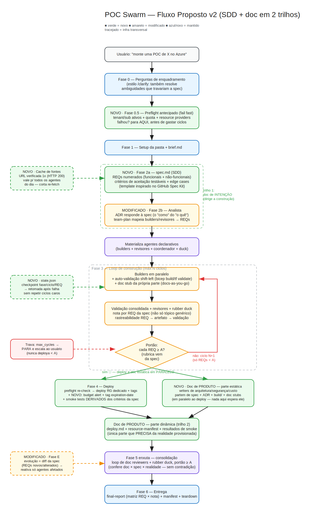

# POC Swarm 🛠️🐝

[](https://orcid.org/0009-0006-0765-4201)
[](https://creativecommons.org/licenses/by/4.0/)
[](https://github.com/github/copilot-cli)
[](https://github.com/EdneiMonteiro/poc-swarm/commits)

Skill do **Copilot CLI** que monta um **enxame de agentes declarativos** para
**projetar, construir, validar, revisar e provisionar uma Prova de Conceito (POC)
no Azure** — no tenant e subscription que você indicar — e, ao final, **gerar a
documentação** com um **swarm de documentação nativo**.

Reutiliza um motor de swarm de ponta a ponta: **spec com critérios de aceitação
testáveis (SDD — spec-driven development)**, agentes `.md` autocontidos, **modelo
explícito por agente**, human-in-the-loop no início, **≥ 5 fontes oficiais verificadas
(HTTP 200)**, régua **D- … A+ com portão ≥ A**, **rubber duck** transversal e
rastreabilidade total em `reports/`. O domínio é **engenharia de POC em Azure**, com
**validação técnica real** e **deploy** dos artefatos.

> Skill (fonte da verdade): `SKILL.md` (na raiz deste repo)
> Saída das POCs: por padrão `<clone>\pocs\<YYYY-MM-DD>-POC-<XX>\`
> (configurável — ver [Instalação](#instalação) e [Local de saída](#local-de-saída))

> ⚠️ **Esta skill provisiona recursos reais no Azure** (por padrão, deploy automático) —
> use **assinaturas de sandbox/laboratório**, nunca produção, e rode o **teardown** ao
> final. Veja [DISCLAIMER.md](./DISCLAIMER.md) e [SUPPORT.md](./SUPPORT.md).

---

## Instalação

A skill é distribuída como este repositório. Para instalar em qualquer máquina:

```bash
# Linux/macOS
git clone <url-deste-repo> ~/Projects/poc-swarm
cd ~/Projects/poc-swarm
./scripts/install.sh
# opcional: tenta instalar também o toolchain de validação/deploy (az/bicep/terraform/tflint/checkov):
#   ./scripts/install.sh --with-tools
```

```powershell
# Windows (PowerShell)
git clone <url-deste-repo> $HOME\Projects\poc-swarm
cd $HOME\Projects\poc-swarm
pwsh scripts\install.ps1
# opcional: tenta instalar também o toolchain de validação/deploy:
#   pwsh scripts\install.ps1 -WithTools
```

O instalador cria o symlink `~/.copilot/skills/poc-swarm` → raiz deste repo, para o
Copilot CLI reconhecer a skill (confirme com `/skills` após reiniciar).

> **Windows:** o symlink exige **Developer Mode** habilitado (Settings → Privacy &
> security → For developers) ou terminal elevado; sem isso, o instalador cai
> automaticamente para *junction*.

> **Documentação:** a POC Swarm gera a documentação final (Fase 5) com um **swarm de
> documentação nativo** em **dois trilhos** — o estático roda **em paralelo ao deploy**
> — (doc writers + doc reviewers + rubber duck, portão ≥ A), sem dependências externas.

### Toolchain de validação & deploy

O motor de agentes roda sem dependências extras, mas a **validação** e o **deploy**
precisam de:

- **`az` CLI** + extensão **Bicep** (`az bicep install`), com **login ativo** (`az login`).
- **Terraform** (se usar Terraform como IaC) + provider `azurerm`/`azapi`.
- **Linters/segurança:** `tflint`, `checkov`, **PSRule for Azure** (conforme o IaC).

Ao final da instalação, o script **checa** esse toolchain e lista o que falta. Use
`--with-tools` (bash) ou `-WithTools` (PowerShell) para tentar instalar automaticamente
(winget no Windows; apt · dnf · brew no Unix; pip para checkov).

### Local de saída

O `<OUTPUT_ROOT>` é resolvido em runtime:

1. **Destino explícito** que você indicar no pedido.
2. **Variável de ambiente `POCSWARM_ROOT`**, se definida.
3. **Default:** `<clone>\pocs`, onde `<clone>` é onde este repo foi clonado (resolvido
   pelo alvo real do symlink da skill).

As entregas em `pocs/` **não** são versionadas (estão no `.gitignore`) — são o produto
local de cada execução, não parte da distribuição da skill.

---

## Como funciona

Quando você pede "monte uma POC de X no Azure", a skill não escreve nem deploya às cegas.
Ela decompõe o trabalho e roda **dois swarms encadeados** dentro de uma **pasta única**
`<YYYY-MM-DD>-POC-<XX>`, dirigidos por uma **spec (SDD — spec-driven development)**:

### 1) Swarm de Construção

1. **Pergunta** o essencial (objetivo, **tenant/subscription/região**, restrições,
   preferências de IaC/rede/auth, limite de custo, teardown, nº de ciclos), resolvendo
   as ambiguidades que travariam a spec.
2. **Preflight antecipado (fail fast):** valida tenant/subscription ativos, quota,
   resource providers e toolchain **antes** de gastar qualquer ciclo de agente.
3. Um **Analista** escreve a **spec** (`spec.md`): REQs numerados com **critérios de
   aceitação testáveis** ("dado/quando/então") — o contrato que dirige construção,
   revisão, smoke test e documentação (aceita specs do [GitHub Spec Kit](https://github.com/github/spec-kit)
   como entrada). Depois escreve o **ADR** (`architecture-decision.md`) respondendo à
   spec: recursos, **rede pública vs privada**, **IaC** (Bicep / Terraform / az CLI),
   **chaves vs Managed Identity**, região, custo, riscos — tudo verificado contra a
   **documentação oficial** e o **estado real** do Azure.
4. O Analista decide **quantos agentes e quais perfis** o enxame precisa
   (`team-plan.md`), **mapeados aos REQs da spec**, e a skill **materializa** builders,
   revisores técnicos, coordenador e rubber duck.
5. Por ciclo: **builders** desenvolvem os artefatos (prontos para validar + doc stubs) →
   **validação real** (`bicep build`/`terraform validate`+`plan`,
   `tflint`/`checkov`/`PSRule`, `what-if`) → **peer review técnico** (nota D-…A+ **por
   REQ** e por tópico, com rastreabilidade REQ → artefato → validação) → **rubber
   duck** → **portão ≥ A**. O progresso fica em `state.json` — execuções interrompidas
   **retomam do checkpoint**.
6. Fechado o portão: **re-check do preflight** → **deploy** no **RG dedicado** com
   **tags** → **smoke test derivado dos critérios de aceitação da spec** → **budget
   alert** com o limite informado + tag de expiração → **teardown** pronto.

### 2) Swarm de Documentação (dois trilhos)

7. A doc de **intenção** (spec + ADR) já nasceu antes da construção. A doc de
   **produto** roda em dois trilhos: o **estático** (arquitetura, segurança & rede,
   custo) parte de spec/ADR/artefatos **em paralelo ao deploy**; o **dinâmico**
   documenta a realidade provisionada (deploy, manifest, smoke por REQ) após a Fase 4.
   Doc writers + doc reviewers + rubber duck — a documentação final passa pelo
   **portão ≥ A**.

A premissa: **qualidade vem de spec com critérios testáveis + especialização + validação
técnica real + revisão iterativa com régua dura + evidência verificável + deploy
comprovado por smoke test.**

### Diagrama do fluxo



> O `.svg` é exportado a partir da fonte editável
> [`docs/diagrams/fluxo.excalidraw`](./docs/diagrams/fluxo.excalidraw), que pode ser
> aberta em [excalidraw.com](https://excalidraw.com).

---

## Quando dispara (triggers)

Use frases como:

- "monte uma POC de `<solução>` no Azure"
- "crie/implemente uma prova de conceito de `<X>` na subscription `<Y>`"
- "quero um POC de `<serviço/arquitetura>` com IaC no meu tenant"
- "prove o conceito de `<X>` no Azure e documente"

**Não dispara** para pedidos que são só documento/apresentação (sem construir nada no
Azure) nem para pedidos triviais. Também há **modo evolução** para expandir uma POC já entregue.

---

## Segurança

- **Preflight read-only em dois momentos** — logo após as perguntas (fail fast, antes
  de gastar ciclos de agente) e de novo **antes** de qualquer `apply`/`create` —
  confirma que o **tenant/subscription ativos** batem com o pedido; se não baterem, a
  skill **para e alerta**.
- **RG dedicado** por POC (`rg-poc-<slug>-<env>`), **tags** padronizadas (incluindo
  `expiration-date`) e **teardown** sempre gerado.
- **Guardrail de custo:** o limite de orçamento informado vira **budget alert** no RG
  logo após o deploy.
- Prefere **Managed Identity**; segredos só via **Key Vault**, nunca versionados.
- **Sem dados sensíveis no repositório:** IDs reais de tenant/subscription e nomes de
  cliente/projeto interno **nunca** entram em arquivos versionados — use placeholders. O
  contexto real fica só no `brief.md` local, dentro de `pocs/` (no `.gitignore`).
- Verifica o **estado real** do Azure — nunca presume defaults de configuração.

---

## Licença e avisos

Distribuído sob [CC BY 4.0](./LICENSE). Uso por sua conta e risco — veja
[DISCLAIMER.md](./DISCLAIMER.md) (atenção especial ao provisionamento de recursos reais) e
[SUPPORT.md](./SUPPORT.md). Se usar este material, por favor cite (ver `CITATION.cff`).

## 🤝 Contribuindo

A criação de issues e pull requests neste repositório é restrita a colaboradores.
Veja [CONTRIBUTING.md](CONTRIBUTING.md) para detalhes.
